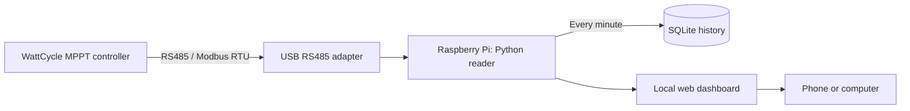

# WattCycle Solar Monitor — Raspberry Pi RS485 / Modbus dashboard

A lightweight, read-only **WattCycle solar charge controller monitor** for
**Raspberry Pi and Linux**, using a **USB RS485 adapter** and **Modbus RTU**.
Read battery voltage, charging power, solar panel voltage, temperatures, and
daily energy generation in a web dashboard, and keep your readings in SQLite
for years.

Tested with a **WattCycle 30 A MPPT controller reporting model `M-2430N`**
(marketed as M2430), a CH340 USB serial adapter, and a **Raspberry Pi 2 Model B**.
The collector and dashboard use only the Python standard library. No pip
packages, Docker, Home Assistant, MQTT broker, or Node.js runtime are needed.

> Looking for a “Watcycle controller” RS485 or Modbus reader? The brand spelling
> is **WattCycle**; this project targets the M2430 / M-2430N controller described
> below.



## Features

- **Live dashboard:** charge watts/current, battery and PV voltage, daily Wh,
  daily peak watts, charge stage, controller temperature, battery temperature
  field, load state, and raw fault bits.
- **One-minute collection:** one background reader regardless of browser count.
- **Long-term storage:** every successful reading is retained indefinitely,
  subject to available disk space. The graph shows the most recent 24 hours.
- **Read-only controller access:** only Modbus function `0x03`; no charging
  setpoints or load controls are written.
- **Reliable framing:** Modbus CRC, slave ID, response length, and model checks.
- **Failure visibility:** stale readings, serial failures, and storage failures
  are shown on the page; polling retries automatically.
- **Small footprint:** works on the tested 32-bit Raspberry Pi 2; responsive,
  self-contained HTML with no CDN, external fonts, or analytics.
- **Automatic startup:** optional systemd user service.
- **JSON endpoints:** build your own integrations using `/api/status` and
  `/api/history`.

## Hardware and compatibility

| Item | Tested configuration |
| --- | --- |
| Controller | WattCycle 30 A MPPT, model response `M-2430N` |
| Host | Raspberry Pi 2 Model B Rev 1.1, 32-bit Linux, Python 3.13 |
| Adapter | CH340-based USB serial converter, USB ID `1a86:7523`, installed RS485 link |
| Serial parameters | 9600 baud, 8 data bits, no parity, 1 stop bit |
| Modbus address | 1 by default |
| Read function | `0x03` — holding registers |

The CH340 USB identifier alone does **not** prove that an adapter exposes
RS485 electrically; use an actual USB-to-RS485 adapter and the controller's
documented wiring. Connector pin orientation has not been verified by this
project, so no universal RJ12 pinout is provided.

Other WattCycle models, HQST controllers, and Helios controllers are **not
hardware-tested here**. A matching HQST protocol document helped identify the
register map, but this does not establish compatibility with every controller
using that document. The reader rejects a model response other than `M-2430N`.
See [protocol and register map](docs/protocol.md).

## Quick start on Raspberry Pi / Linux

You need Linux, Python 3.9 or newer, Git, and serial-port access. Run these
commands on the machine with the USB adapter attached.

```sh
git clone https://github.com/hardtomakeanadress/wattcycle-solar-monitor.git
cd wattcycle-solar-monitor
ls -l /dev/serial/by-id/
```

If needed on Raspberry Pi OS / Debian, grant your login user serial access:

```sh
sudo usermod -aG dialout "$USER"
```

Log out and back in after changing groups. Select your actual adapter path:

```sh
export SOLAR_PORT=/dev/serial/by-id/usb-1a86_USB_Serial-if00-port0
python3 read_controller.py
```

This prints one JSON snapshot and exits. Once that succeeds, start the dashboard:

```sh
python3 dashboard/server.py
```

Open **`http://YOUR_PI_IP:8080`** from a phone or computer on the same network.
The first reading normally appears within a few seconds. Do not run the
standalone reader alongside the dashboard or another serial polling program.

Stop the foreground server with Ctrl+C. For startup at boot, follow the
[systemd deployment guide](docs/deployment.md).

## Configuration

Configuration uses environment variables, inherited by the reader subprocess.

| Variable | Default | Purpose |
| --- | --- | --- |
| `SOLAR_PORT` | `/dev/serial/by-id/usb-1a86_USB_Serial-if00-port0` | Linux USB serial device |
| `SOLAR_SLAVE` | `1` | Modbus slave address, 1–247; does not change the controller's address |
| `SOLAR_DATABASE` | `dashboard/history.sqlite3` in this checkout | SQLite file; use an absolute path for custom storage |
| `DASHBOARD_BIND` | `0.0.0.0` | Network interface to listen on |
| `DASHBOARD_PORT` | `8080` | HTTP port |

Collection occurs every **60 seconds**. Browsers fetch cached status every five
seconds and graph data every minute. Readings older than **180 seconds** are
marked stale. These browser requests do not trigger additional serial reads.

The dashboard has no login or TLS and is intended for a trusted LAN or private
VPN. For remote use, access that network through a VPN or add an authenticated
reverse proxy. Do not expose port 8080 directly to the public internet.

## Storage and interpretation

Records are saved on the host in SQLite and survive application restarts. There
is no age-based deletion or downsampling of the stored records. Available disk
space and functioning storage are required; keep a backup on another device
for data you want to retain for years. See [backup and maintenance](docs/deployment.md#backups).

The graph shows the latest 24 hours using the last reading from each five-minute
bucket; it does not currently provide a date-range picker for older data.
Older records remain queryable in the database.

Battery percentage is the controller's estimate, not a BMS or shunt measurement.
The battery-temperature register does not prove that an external sensor is
installed. Daily generation is the controller's Wh counter, not an integration
of the displayed graph. Full readings include raw registers for diagnosis.

## Development and tests

The Python tests simulate serial responses and database failures; they do not
need connected hardware or change controller settings.

```sh
python3 -m unittest discover -s dashboard -p 'test_*.py' -v
```

With Node.js installed **for development only**, test the page's JavaScript:

```sh
node scripts/test_frontend.cjs
```

CI runs both suites. See [CONTRIBUTING.md](CONTRIBUTING.md) for hardware reports
and changes. The deployed application itself does not use Node.js.

## License and attribution

[MIT](LICENSE). Independent community software, not affiliated with or endorsed
by WattCycle, HQST, or Helios. Third-party manuals are linked in the
[protocol reference](docs/protocol.md), not redistributed or covered by this
project's license.
