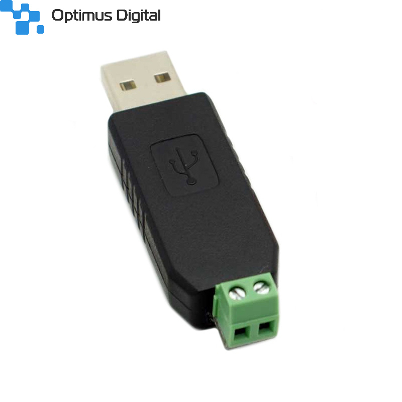
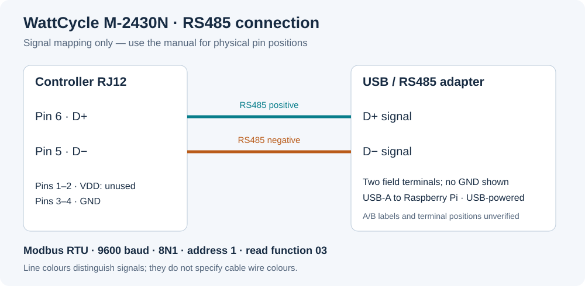

# Hardware, USB adapter, and RJ12 wiring

Updated 14 September 2026. The tested controller returns model `M-2430N` and
communicates through a CH340-based USB/RS485 adapter on Raspberry Pi Linux.
The owner supplied the adapter product link and confirmed the published
controller pinout. No physical cable inspection was performed remotely.

## Adapter used



Retailer product photograph, not a photograph of the deployed unit.
[Source and attribution](third-party.md#adapter-photograph).

Product: [Optimus Digital Convertor USB la RS485](https://www.optimusdigital.ro/ro/interfata-convertoare-usb-la-serial/13279-convertor-usb-la-rs485.html),
reference **0104110000090720**, product ID **13279**.

| Feature | Evidence |
| --- | --- |
| Conversion | USB to RS485, seller listing |
| Host connector | USB Type-A male, product photos |
| Field connector | Green two-position screw terminal, product photos |
| Enclosure | Black housing, product photos |
| Ground terminal | No separate terminal visible in product photos |
| USB bridge | CH340 family; installed USB ID `1a86:7523` |
| Power | USB-powered in the tested installation |
| Linux device | `/dev/ttyUSB0` during testing |
| Stable device name | `/dev/serial/by-id/usb-1a86_USB_Serial-if00-port0` |
| Verified setting | 9600 baud, 8N1, Modbus RTU address 1, function 03 |

The seller's main and supplementary descriptions contain no electrical
datasheet. Maximum baud rate, cable length, node count, supply current,
isolation, surge/ESD protection, termination, dimensions, and temperature
limits are unspecified. An English-page image caption mentions FT232; the
installed device's USB enumeration instead identifies CH340. Use the measured
identity for this installation, not the caption or specifications of a similar
looking adapter. Terminal polarity labels are not legible in the product photos.

The by-id name has no unique serial number: multiple identical adapters may
need a physical by-path device name. `/dev/ttyUSB0` numbering can change.

## Controller RJ12 pinout

Both the official WattCycle manual and the Helios N-series manual give this
pinout. The owner confirmed it correct on 14 September 2026.

| RJ12 pin | Signal | Connection notes |
| --- | --- | --- |
| 1 | VDD | Accessory supply; leave disconnected for this USB adapter |
| 2 | VDD | Accessory supply; leave disconnected for this USB adapter |
| 3 | GND | Controller signal ground |
| 4 | GND | Controller signal ground |
| 5 | D− | RS485 negative data signal |
| 6 | D+ | RS485 positive data signal |

VDD is specified as **3.3 V, 20 mA** accessory power. It is not needed to power
this USB adapter. The photographed adapter exposes only two field terminals;
there is no separate ground connection shown.



This is a **signal mapping**, not a drawing of terminal positions. Match D− to
D− and D+ to D+. Do not infer left/right positions or A/B polarity from this
diagram or a wire colour. The adapter's physical A/B mapping and cable colours
were not recorded. Existing communication passed CRC validation.

Use the numbered connector drawings in the manuals to locate the pins:

- [WattCycle manual](manuals/WattCycle-30A-MPPT-User-Manual.pdf#page=5):
  section 9, printed page 8, PDF page 5.
- [Helios manual](manuals/Helios-MPPT-N-Series-User-Manual.pdf#page=6):
  section 11, printed page 10, PDF page 6.

Plug and socket views are mirrored. This pinout applies to the documented
controller family; other RS485 devices can use different connectors and wiring.

## Communication check

On the Raspberry Pi, inspect enumeration and serial permissions:

```sh
lsusb
ls -l /dev/serial/by-id/
id
```

The tested account had access through the `dialout` group. From the repository
directory, with the dashboard and other serial readers stopped:

```sh
export SOLAR_PORT=/dev/serial/by-id/usb-1a86_USB_Serial-if00-port0
python3 read_controller.py
```

A successful read checks framing, slave address, CRC, and controller model.
See [protocol and register map](protocol.md) for decoding and
[deployment](deployment.md) for the dashboard and service setup.

## Recorded validation

On 13 September 2026, the reader received valid identification and telemetry
responses. At 14:02:56 UTC the model was `M-2430N`, the battery was 27.3 V,
charging was 1.87 A / 51 W, PV was 49.3 V, and generation for that day was
336 Wh. The charge state was float and fault bits were zero. These are a
historical sample, not current live readings. No controller settings were changed.
